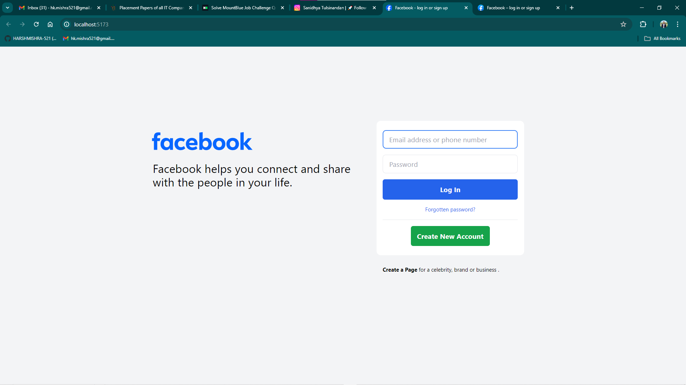

# Facebook Homepage Clone

A clone of the Facebook homepage built with Tailwind CSS.

## Table of Contents

- [Facebook Homepage Clone](#facebook-homepage-clone)
  - [Table of Contents](#table-of-contents)
  - [Project Overview](#project-overview)
  - [Setup Tailwind CSS](#setup-tailwind-css)
  - [Project Structure](#project-structure)
  - [Screenshots](#screenshots)
  - [Author](#author)

## Project Overview

This project is a clone of the Facebook homepage, styled using Tailwind CSS. It demonstrates the use of utility-first CSS for rapid UI development.

## Setup Tailwind CSS

To set up Tailwind CSS, follow these steps:

1. **Initialize the project as a Node.js project:**
   ```
   npm init -y
   ```

2. **Install required packages:**
    ```
    npm install -D tailwindcss postcss autoprefixer vite
    ```

3. **Generate Tailwind CSS configuration:**
   ```
   npx tailwindcss init -p

   ```

4. **Create a CSS file named input.css, add it to your HTML, and edit it with the following content:**
   ```
    @tailwind base;
    @tailwind components;
    @tailwind utilities;
   ```

5. **In your tailwind.config.js file, replace content: [] with:**
   ```
    content: ["*"],

   ```

6. **Add the following script to your package.json:**
   ```
    "scripts": {
    "start": "vite"
    }
   ```

7. **Run the following command to start the development server:**
   ```
   npm run start

   ```

## Project Structure

```
└── 📁Facebook_homepage_clone
    ├── .hintrc
    ├── facebook.svg
    ├── favicon.png
    ├── index.html
    ├── package-lock.json
    ├── package.json
    ├── postcss.config.js
    ├── readme.md
    ├── style.css
    └── tailwind.config.js

```

## Screenshots

- Here is a screenshot of the cloned Facebook homepage:



## Author

- ``` Harsh Mishra ```