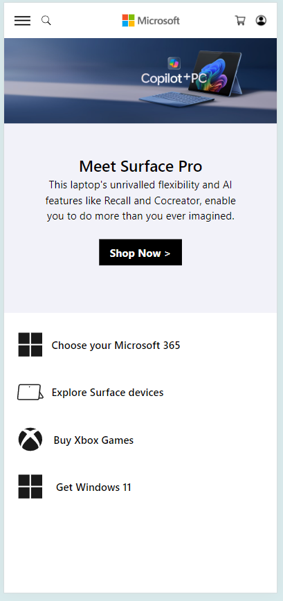

# Microsoft Homepage Clone

A clone of the Microsoft homepage built with Tailwind CSS.

## Table of Contents

- [Microsoft Homepage Clone](#microsoft-homepage-clone)
  - [Table of Contents](#table-of-contents)
  - [Project Overview](#project-overview)
  - [Setup Tailwind CSS](#setup-tailwind-css)
  - [Project Structure](#project-structure)
  - [Screenshots](#screenshots)
  - [Author](#author)

## Project Overview

This project is a clone of the Microsoft homepage, styled using Tailwind CSS. It demonstrates the use of utility-first CSS for rapid UI development.

## Setup Tailwind CSS

To set up Tailwind CSS, follow these steps:

1. **Initialize the project as a Node.js project:**
   ```
   npm init -y
   ```

2. **Install required packages:**
    ```
    npm install -D tailwindcss postcss autoprefixer vite
    ```

3. **Generate Tailwind CSS configuration:**
   ```
   npx tailwindcss init -p

   ```

4. **Create a CSS file named input.css, add it to your HTML, and edit it with the following content:**
   ```
    @tailwind base;
    @tailwind components;
    @tailwind utilities;
   ```

5. **In your tailwind.config.js file, replace content: [] with:**
   ```
    content: ["*"],

   ```

6. **Add the following script to your package.json:**
   ```
    "scripts": {
    "start": "vite"
    }
   ```

7. **Run the following command to start the development server:**
   ```
   npm run start

   ```

## Project Structure

```
└── 📁Microsoft_Clone
    └── .gitignore
    └── 📁assets
        └── account.png
        └── ic1.svg
        └── ic2.svg
        └── ic3.svg
        └── ic4.svg
        └── ms-right.avif
        └── ms.avif
        └── mslogo.png
        └── search.svg
        └── shopping-cart.png
    └── index.html
    └── package-lock.json
    └── package.json
    └── postcss.config.js
    └── Readme.md
    └── style.css
    └── tailwind.config.js


```

## Screenshots

- Here is a screenshot of the cloned Microsoft homepage:




## Author

- ``` Harsh Mishra ```